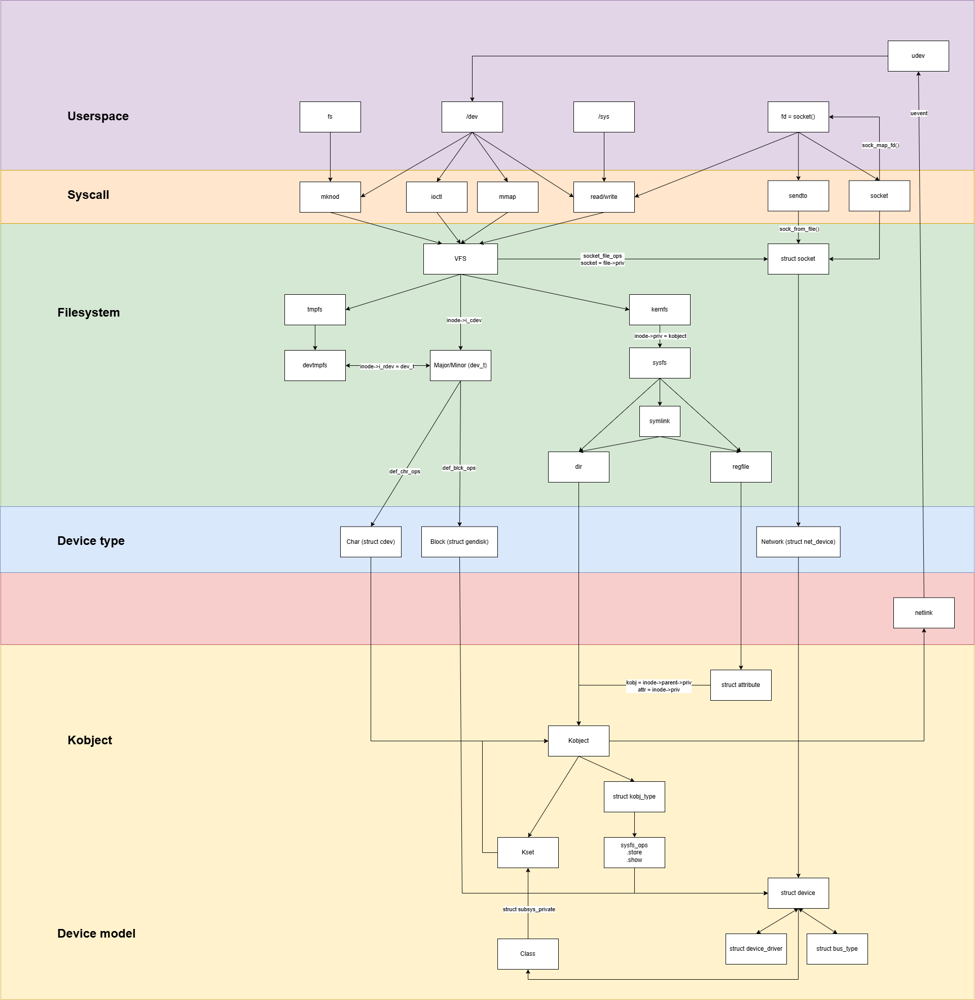
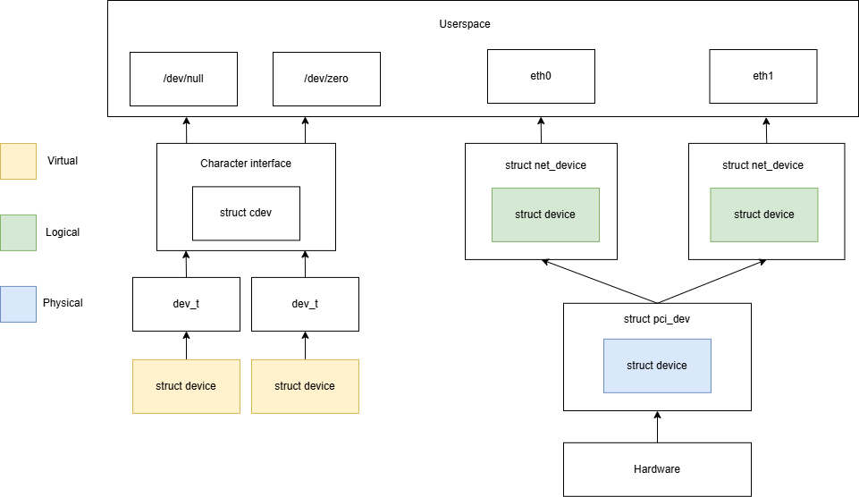
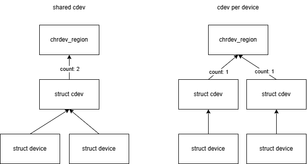

# *Userspace communication with devices*
## Overview
This document describes methods of userspace communication with devices from a device-type point of view. It provides a brief explanation of kernel structures that participate in communication and how they work together, mainly focusing on character devices.

## Device types
From the userspace perspective, there are 3 device types:
- **Character device** (struct cdev) is used for byte-stream-oriented devices (keyboard, /dev/null).
- **Block device** (struct gendisk) is used for devices that store data in blocks and can be accessed in arbitrary order (disk).
- **Network device** (struct net_device) is used for network interfaces (NIC).  

## Driver, device, bus
- **struct bus_type** represents a bus and defines how devices and drivers are matched.
- **struct device_driver** represents a driver bound to a specific bus.
- **struct device** represents a device instance, contains information about the bus it is on and the driver it's bound to.  

### struct device
**(?)** struct device may represent:
- **physical device**: a hardware device that is physically attached to the system via a bus (PCI, USB, etc). struct device for a physical device is always allocated by the kernel/bus subsystem and then passed to the driver's probe() method. (hardware -> physical device -> driver logic).  
One physical device may be associated with multiple logical devices -> can have several interfaces.
- **virtual device**: a device that isn't attached to any bus (no hardware). They usually emulate hardware or provide a service to the system. (module logic -> virtual device -> userspace)
   - /dev/null - provides a service. struct device exists so a communication interface can be registered and exposed to userspace.
   - sys/devices/virtual/workqueue, struct device is used to expose sysfs attrs to userspace.
- **logical device**: a middleware object that provides functionality to connected objects.  
   - a bridge between hardware and userspace (hardware -> physical device -> logical device -> userspace)  
   - a part of a communication chain inside a kernel subsystem (hardware -> physical device -> input_device (logical device) -> evdev (logical device) -> userspace)

 Device types (char, block, network) define communication interface with userspace, so they may be virtual (standalone functionality) or logical devices (part of a communication chain between hardware and userspace).

*Example*: A network card is connected to the system via PCI bus and the system creates a struct pci_dev instance to describe this **physical device**. Then in probe() this device is matched with a network driver -> struct net_device is allocated, which represents a **logical device**. The logical device is then associated with the hardware device using [SET_NETDEV_DEV](https://elixir.bootlin.com/linux/v6.16/source/drivers/net/ethernet/natsemi/ns83820.c#L1929) -> [parent](https://elixir.bootlin.com/linux/v6.16/source/include/linux/netdevice.h#L2742) of the net_device is now pci_dev.

## Kobject
- **Kobject** is a base object for kernel objects (buses, devices, drivers, etc). It's responsible for reference counting and relationships between objects (parent-child). Kobject **must** have a name, due to its use in sysfs.  
- Each kobject has a **ktype** (struct kobj_type), which defines default sysfs_ops and attributes for this type. Multiple kobjects can share the same ktype.  
**(?)** Is this ktype? [From here](https://lwn.net/Articles/645810/:)
>  `grep DEVTYPE /sys/class/block/*/uevent`  
- **Kset** is a list of kobjects grouped together. (/sys/bus, /sys/class)   
- [struct class](https://elixir.bootlin.com/linux/v6.16/source/include/linux/device/class.h#L50) - 
> is a higher-level view of a device that abstracts out low-level implementation details.  Drivers may see a SCSI disk or an ATA disk, but, at the class level, they are all simply disks. Classes allow user space to work with devices based on what they do, rather than how they are connected or how they work.   

Class internally owns a [kset](https://elixir.bootlin.com/linux/v6.16/source/drivers/base/class.c#L650). During [class_create](https://elixir.bootlin.com/linux/v6.16/source/drivers/base/class.c#L178) internal struct subsys_private is created, which stores a list of devices (kset) and register this class in sysfs. Devices created via device_create() have a class. (device -> class -> subsys_private -> sysfs)  

## Communication interfaces
### /sys
**/sys** is mounted as sysfs (pseudo fs based on kernfs). Sysfs reflects relationships between kernel objects and exposes their attributes.  
Only kobjects that call [kobject_add](https://elixir.bootlin.com/linux/v6.16/source/lib/kobject.c#L377) appear in sysfs.  (kobject_add -> create_dir -> sysfs_create_dir_ns)  
`device_create()` internally calls kobject_add, so all registered devices automatically appear in sysfs /sys/devices and in /sys/class (symlink to an actual file in /sys/devices)
- dir represents struct kobject
- regfile represents struct attribute
- symlink represents non-hierarchical relationships between kernel objects
- dir with subdirs represents struct kset
- /sys/class contains classes

In context of communication between userspace and device, sysfs is used for providing an interface for accessing attributes of the device (small amount of data: control, configuration, status).  

You can create your own custom attributes for your kobject (device).  
**(?)** Where to put attributes? kernel_kobj, devgroups?
Custom sysfs attributes that describe hardware state or configuration should be attached to the existing device instance using `dev_groups` or `sysfs_create_group()`.

### /dev
/dev is backed by devtmpfs (based on tmpfs). devtmpfs is the main interface between userspace and char/block devices. Files in devtmpfs are created automatically when [device_create](https://elixir.bootlin.com/linux/v6.16/source/drivers/base/core.c#L3666) is called. (device_create -> device_add -> devtmpfs_create_node)  

devtmpfs works only with 2 device types: char and block, so there is 2 file types (device special files): S_IFCHR and S_IFBLK. During file creation VFS allocates an inode (file representation in the kernel), and for device special files fills in a field [inode->i_rdev](https://github.com/intaklunik/myfs/blob/main/Notes.md#struct-inode) with unique device identificator - **major/minor number**. (devtmpfs_create_node -> devtmpfs_submit_req -> devtmpfs_work_loop -> handle_create -> [vfs_mknod](https://elixir.bootlin.com/linux/v6.16/source/drivers/base/devtmpfs.c#L233))

 Userspace can open those files and interact via **struct file_operations**. File operations belong to char/block interface, so when they are called, char->fops is called.

#### struct file_operations
   - read/write - for data transfer
      - helpers: copy_to_user/copy_from_user, get_user/put_user, access_ok
   - [ioctl](https://github.com/intaklunik/myfs/blob/main/Notes.md#unlocked_ioctl) - device control and configuration
   - mmap - memory mapping

#### Major/Minor number
**Major/Minor number** (dev_t) uniquely identifies a **character** or **block** device.   
**Major** number represents device driver type.  
**Minor** number represents a specific device instance handled by this driver.  
dev_t forms the connection between a device file and a struct [cdev](https://elixir.bootlin.com/linux/v6.16/source/fs/char_dev.c#L386)/struct gendisk.

**Network devices** do not use major/minor numbers, they are identified by **ifindex** field in struct net_device.

#### udev
As mentioned above, kobject is a base class for struct device and it is involved in sending notifications to userspace about device adding/removal.  
**udev** is a userspace monitoring utility (part of systemd) for **uevents** (userspace events). Whenever `device_create()` is called, uevent (KOBJ_ADD) is generated in the kernel and delivered to userspace via **netlink**. ([List of events](https://elixir.bootlin.com/linux/v6.16/source/include/linux/kobject.h#L53))  
**(?)** At this point, the device file in /dev has already been created by the kernel via devtmpfs. udev then changes permissions, ownership.

#### Monitor uevents
`udevadm monitor --environment`  
`udevadm info /dev/mydevice`

### socket
Network devices communicate with userspace via **socket**:
- kernel: struct socket
- userspace: file descriptor (fd = socket())  

So, from userspace perspective socket is a special file (S_IFSOCK) (inode? sockfs?) and has a struct file (open file), therefore it supports file_operations.  
Socket's file_operations are predefined by the kernel - **socket_file_ops**. Field file->priv contains pointer to the struct socket.

## Character device
A character device driver consists of 3 layers:
- **chrdev region** defines which major/minor numbers the driver owns.
- **struct cdev** binds those numbers to kernel behavior via file operations. Range of major/minor numbers may differ from allocated chrdev region. One chrdev region may be associated with multiple cdevs.
- **struct device** (optional) when used it connects the char device to the device model, enabling automatic node creation in /dev and visibility in sysfs.
   - cdev POV: character interface is already registered in the kernel, we need to make this interface automatically accessible in userspace (/dev and sysfs).
   - device POV: device is already registered in the kernel, we need to create a userspace communication interface for it -> cdev.

### Character device registration
1. Register chrdev region:
   - register_chrdev_region() - based on [*major*](https://elixir.bootlin.com/linux/v6.16/source/Documentation/admin-guide/devices.txt) number and number of *minors*
   - alloc_chrdev_region() - based on number of *minors* (free *major* is dynamicaly selected)
2. Call cdev_init() -> cdev + fop: initialize cdev, attach file_operations
3. Call cdev_add() -> cdev + dev_t: attach dev_t to cdev, adds cdev to cdev_map

**(!)** After that there will be a registred char IO interface in the kernel. But for actual communication with userspace, we need an entry point in /dev. For that:
   - manually from userspace call `mknod /dev/filename c MAJOR MINOR`. It will connect struct inode with file_operations from cdev (no struct device).  

Or  
   - char device file will be automatically created from the kernel call `device_create`.   
Internaly it will do: 
   1. allocate struct device
   2. attach dev_t to struct device ([for sysfs "dev"](https://elixir.bootlin.com/linux/v6.16/source/include/linux/device.h#L655))
   3. attach class to struct device
   4. initialize internal struct kobject
   5. register in sysfs based on kobject->parent: will be created a directory in /sys/devices. For devices with no parent will be created a ["virtual"](https://elixir.bootlin.com/linux/v6.16/source/drivers/base/core.c#L3261) directory (/sys/devices/virtual).
   6. register in sysfs based on device class: device_add -> [device_add_class_symlinks](https://elixir.bootlin.com/linux/v6.16/source/drivers/base/core.c#L3451) -> sysfs_create_link
   7. register this device in devtmpfs
   8. send uevent (KOBJ_ADD) to udev
   9. udev updates devtmpfs file (?)  
      
In this case there will be cdev + struct device.  
**(!)** First argument of device_create is a pointer to the class that this device should be registered to, so class_create() must be called before device_create().

### struct cdev
todo  
cdev_add vs [cdev_device_add](https://elixir.bootlin.com/linux/v6.16/source/fs/char_dev.c#L544)

**(?)** *Example*: struct i2c_dev embedes struct cdev -> what about chrdev region? -> i2c kernel module [registers chrdev region](https://elixir.bootlin.com/linux/v6.16/source/drivers/i2c/i2c-dev.c#L765) -> when new struct i2c_dev is allocated, it receives minor number from struct i2c_adap [adap->nr](https://elixir.bootlin.com/linux/v6.16/source/drivers/i2c/i2c-dev.c#L72). adap_nr is compared to I2C_MINORS ((MINORMASK + 1) -> ((1U << MINORBITS) - 1) = maximum minor) -> so, amount of i2c cdev has limits, but only theoretically.  

## Summary
- /sys - attribute-based communication (configuration, control, status)
- /dev - primary data communication via read/write
- /dev + ioctl - control and configuration operations

## Useful links
- [Everything you never wanted to know about kobjects, ksets, and ktypes](https://docs.kernel.org/core-api/kobject.html)
- [A fresh look at the kernel's device model](https://lwn.net/Articles/645810/)
- [The cdev interface](https://lwn.net/Articles/195805/)

